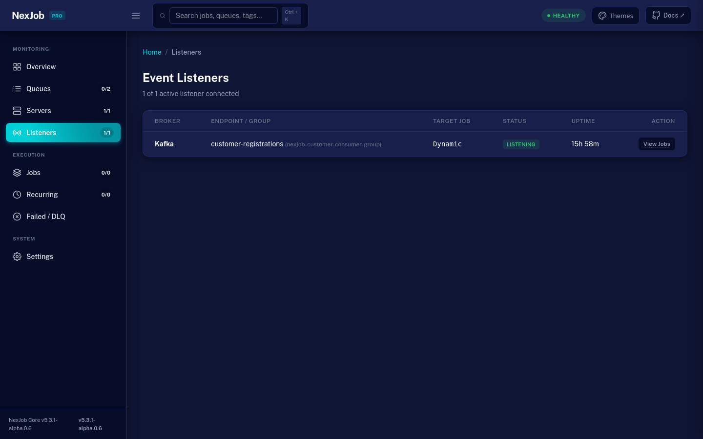

<div align="center">

<br/>

```
███╗   ██╗███████╗██╗  ██╗     ██╗ ██████╗ ██████╗
████╗  ██║██╔════╝╚██╗██╔╝     ██║██╔═══██╗██╔══██╗
██╔██╗ ██║█████╗   ╚███╔╝      ██║██║   ██║██████╔╝
██║╚██╗██║██╔══╝   ██╔██╗ ██   ██║██║   ██║██╔══██╗
██║ ╚████║███████╗██╔╝ ██╗╚█████╔╝╚██████╔╝██████╔╝
╚═╝  ╚═══╝╚══════╝╚═╝  ╚═╝ ╚════╝  ╚═════╝ ╚═════╝
```

**Background jobs for .NET. Predictable. Observable. No magic.**

[](https://www.nuget.org/packages/NexJob)
[](https://www.nuget.org/packages/NexJob)
[](https://github.com/oluciano/NexJob/actions)
[](LICENSE)

<br/>

[](docs/assets/dashboard-overview.png)

</div>

---

## What is NexJob?

NexJob is a reliable background job processing library for .NET 8.
It gives you predictable execution, built-in retries, deadline enforcement, and operational visibility — without the complexity of traditional schedulers.

If you need jobs that **must run, fail safely, and leave a trace**, NexJob handles it as a first-class concern.

---

## Why not Hangfire?

NexJob was built for developers who want Hangfire-like reliability without the paid storage providers or the hidden complexity.

| Feature | NexJob | Hangfire |
|---|---|---|
| Storage providers | 5 free (PostgreSQL, SQL Server, Redis, MongoDB, InMemory) | Free InMemory only; others require paid license |
| Deadline enforcement | Built-in (`deadlineAfter`) | Plugin required |
| Dead-letter handling | Automatic after exhausted retries | Manual |
| Dispatch latency | Near-zero (wake-up channel) | Polling-based |
| Dashboard | Built-in, standalone UI | Built-in (Pro required for advanced) |
| OpenTelemetry | Built-in traces and metrics | Plugin required |
| Concurrency throttling | `[Throttle]` attribute per resource | Queue-level limits |
| Ecosystem | Young library, focused scope | Mature ecosystem, many plugins |
| Package size | ~50 KB | ~2 MB |

NexJob is not a drop-in replacement for Hangfire. If you need calendar-based scheduling, distributed execution across untrusted networks, or enterprise plugin ecosystems, Hangfire is the better choice.

---

## Quick Start

```bash
dotnet add package NexJob
```

```csharp
// 1. Register NexJob and scan for jobs
builder.Services.AddNexJob();
builder.Services.AddNexJobJobs(typeof(Program).Assembly);
```

```csharp
// 2. Define a job
public sealed class SendInvoiceJob : IJob<SendInvoiceInput>
{
    private readonly IEmailService _email;

    public SendInvoiceJob(IEmailService email) => _email = email;

    public async Task ExecuteAsync(SendInvoiceInput input, CancellationToken ct)
        => await _email.SendAsync(input.Email, "Your invoice", ct);
}

public sealed record SendInvoiceInput(string Email);
```

```csharp
// 3. Enqueue from anywhere
var scheduler = app.Services.GetRequiredService<IScheduler>();
await scheduler.EnqueueAsync<SendInvoiceJob, SendInvoiceInput>(
    new SendInvoiceInput("customer@example.com"),
    deadlineAfter: TimeSpan.FromMinutes(5));
```

The job expires if not started within 5 minutes — no silent failures, no zombie jobs.

---

## Core Features

- **`IJob` / `IJob<T>`** — simple and structured job interfaces
- **Predictable retries** — exponential backoff with configurable policies, global + per-job `[Retry]`
- **Deadline enforcement** — jobs expire if not executed in time (`deadlineAfter`)
- **Dead-letter handlers** — automatic fallback when all retries are exhausted
- **Multi-service safe deferral** — foreign jobs from other microservices are automatically deferred without penalizing attempts or dead-lettering
- **Concurrency throttling** — `[Throttle]` attribute for per-resource limits
- **Distributed throttling** — `UseDistributedThrottle()` enforces global cluster-wide rate limits via Redis
- **Job continuations** — chain jobs with parent/child relationships
- **Idempotency** — `DuplicatePolicy` controls re-enqueue behavior
- **Recurring jobs** — via code or `appsettings.json`
- **Job filters** — `IJobExecutionFilter` middleware for cross-cutting behaviour
- **Job retention** — automatic cleanup of terminal jobs with configurable TTL
- **Read replicas** — `UseDashboardReadReplica()` offloads dashboard queries to read replicas (PostgreSQL, SQL Server)
- **Resilient Outbox** — transaction-safe event producers for RabbitMQ and Apache Kafka
- **OpenTelemetry** — traces and metrics built-in
- **Built-in dashboard** — standalone dark UI, zero configuration

---

## Storage Providers

| Provider | Package | Status |
|---|---|---|
| InMemory | `NexJob` (core) | Production ready |
| PostgreSQL | `NexJob.Postgres` | Production ready |
| SQL Server | `NexJob.SqlServer` | Production ready |
| Redis | `NexJob.Redis` | Production ready |
| MongoDB | `NexJob.MongoDB` | Production ready |

All providers implement `IRuntimeSettingsStore` — runtime configuration persists across restarts.

---

## Packages

| Package | NuGet | Description |
|---|---|---|
| `NexJob.Dashboard` | [](https://www.nuget.org/packages/NexJob.Dashboard) | Embedded ASP.NET Core dashboard middleware |
| `NexJob.Dashboard.Standalone` | [](https://www.nuget.org/packages/NexJob.Dashboard.Standalone) | Embedded HTTP dashboard server for Worker Services |
| `NexJob.OpenTelemetry` | [](https://www.nuget.org/packages/NexJob.OpenTelemetry) | OTel SDK instrumentation |
| `NexJob.Trigger.AzureServiceBus` | [](https://www.nuget.org/packages/NexJob.Trigger.AzureServiceBus) | Azure Service Bus trigger |
| `NexJob.Trigger.AwsSqs` | [](https://www.nuget.org/packages/NexJob.Trigger.AwsSqs) | AWS SQS trigger |
| `NexJob.RabbitMQ` | [](https://www.nuget.org/packages/NexJob.RabbitMQ) | RabbitMQ trigger & resilient outbox producer |
| `NexJob.Kafka` | [](https://www.nuget.org/packages/NexJob.Kafka) | Apache Kafka trigger & resilient outbox producer |
| `NexJob.Trigger.GooglePubSub` | [](https://www.nuget.org/packages/NexJob.Trigger.GooglePubSub) | Google Cloud Pub/Sub trigger |
| `NexJob.Trigger.Salesforce` | [](https://www.nuget.org/packages/NexJob.Trigger.Salesforce) | Salesforce Pub/Sub API trigger (gRPC & Avro) |
| `NexJob.Trigger.SalesforceStreaming` | [](https://www.nuget.org/packages/NexJob.Trigger.SalesforceStreaming) | Salesforce Streaming API trigger (CometD & Bayeux) |

---

## Dashboard

The dashboard provides real-time operational visibility into your background jobs, worker nodes, and message broker listeners — with zero external dependencies.

[](docs/assets/dashboard-listeners.png)

- **Maxton Design System:** Modern 64px header, live cluster status indicator, and `Ctrl + K` instant job search.
- **Cluster Pipeline Topology Map:** Native SVG & CSS flow diagram showing Ingress Triggers ➔ Queue Buffers ➔ Worker Nodes.
- **Live Event Listeners:** Dedicated `/listeners` page monitoring connected message brokers (RabbitMQ, Kafka, AWS SQS, Azure Service Bus, Salesforce).
- **Job Catalog & Definitions (`/catalog`):** Aggregated job types, queue distribution, run counts, error rates, deep links to history, and on-demand ad-hoc triggering for parameterless jobs.
- **Server-Sent Events (SSE):** Streaming logs and real-time execution progress bars without page reloads.

### ASP.NET Core Web App

Install package:
```bash
dotnet add package NexJob.Dashboard
```

Configure in `Program.cs`:
```csharp
using NexJob;
using NexJob.Dashboard;

var builder = WebApplication.CreateBuilder(args);

// Register NexJob (InMemory storage by default, or your chosen provider)
builder.Services.AddNexJob();

var app = builder.Build();

// Mount dashboard at /dashboard
app.UseNexJobDashboard("/dashboard");

app.Run();
```

### Worker Service (Standalone)

For Worker Services or console applications without ASP.NET Core:
```bash
dotnet add package NexJob.Dashboard.Standalone
```

Configure in `Program.cs`:
```csharp
using NexJob.Dashboard.Standalone;

builder.Services.AddNexJob();

// Starts an embedded HTTP server at http://localhost:5005/dashboard
builder.Services.AddNexJobStandaloneDashboard(options =>
{
    options.Port = 5005;
});
```

---

## Documentation

Complete documentation is in the [wiki](docs/wiki/Home.md). Key pages:

- **[Mental Model](docs/wiki/00-Mental-Model.md)** — how NexJob works, read this first
- **[Getting Started](docs/wiki/01-Getting-Started.md)** — run your first job in 2 minutes
- **[Best Practices](docs/wiki/13-Best-Practices.md)** — production guidelines
- **[Troubleshooting](docs/wiki/16-Troubleshooting.md)** — debug common issues
- **[Common Scenarios](docs/wiki/15-Common-Scenarios.md)** — real-world use cases with code

---

## Samples & Reference Architecture

The [`samples/`](samples/) directory provides comprehensive, runnable reference architectures for all NexJob capabilities:

| Sample | Stack / Focus | Port | Highlights |
|---|---|---|---|
| [`NexJob.Sample.MinimalApi`](samples/NexJob.Sample.MinimalApi) | ASP.NET Core Minimal API | `5001` | Segregated `IDashboardStorage`, dead-letter handler, deadline enforcement |
| [`NexJob.Sample.WebApi`](samples/NexJob.Sample.WebApi) | ASP.NET Core Web API | `5002` | Dual-storage (InMemory / PostgreSQL), REST endpoints, `.http` file |
| [`NexJob.Sample.WorkerService`](samples/NexJob.Sample.WorkerService) | Headless Console Worker | `5003` | Standalone embedded HTTP dashboard server, graceful shutdown |
| [`NexJob.Sample.ConfiguredRecurring`](samples/NexJob.Sample.ConfiguredRecurring) | Declarative Recurring | `5004` | Zero-code recurring job registration via `appsettings.json` with timezones |
| [`NexJob.Sample.RabbitMQ`](samples/NexJob.Sample.RabbitMQ) | Broker Integration | `5005` | Outbox producer + trigger consumer with 5 trigger guarantees |
| [`NexJob.Sample.Kafka`](samples/NexJob.Sample.Kafka) | Streaming Broker | `5006` | Partitioned Outbox event publishing + consumer trigger with offset tracking |
| [`NexJob.Sample.Storage`](samples/NexJob.Sample.Storage) | Enterprise Topology | `5007` | PostgreSQL primary + read replica (`UseDashboardReadReplica`), Redis throttle (`UseDistributedThrottle`), OTel |
| [`NexJob.Sample.CloudTriggers`](samples/NexJob.Sample.CloudTriggers) | Unified Cloud Consumers | `5008` | AWS SQS, Azure Service Bus, GCP Pub/Sub, Salesforce gRPC & CometD with `/simulate/*` endpoints |

A full local test stack (PostgreSQL 16, Redis 7, RabbitMQ 3.13, and Kafka KRaft) is provided in [`samples/docker-compose.yml`](samples/docker-compose.yml).

---

## Benchmarks

Measured per individual enqueue operation on .NET 8 (BenchmarkDotNet v0.14, RyuJIT AVX2, in-memory storage baseline):

| Metric | NexJob | Hangfire | Comparison |
|---|---|---|---|
| Latency (Mean) | **13.35 µs** | 35.95 µs | **2.7× faster** |
| Memory (Allocated) | **2.10 KB** | 11.20 KB | **81% less memory** |
| GC Gen0 (per 1k ops) | **0.06** | 0.85 | **14× fewer Gen0 collections** |
| GC Gen1 (per 1k ops) | **0.00** | 0.18 | **Zero Gen1 collections** |

NexJob is **2.7× faster**, allocates **81% less memory**, and produces zero Gen1 garbage collections during enqueue bursts. Hangfire incurs additional CPU and allocation overhead due to runtime LINQ expression tree parsing and reflection.

Benchmarks can be parameterized by payload size (`PayloadBytes: 0, 1024, 10240`) and concurrency levels (`ConcurrencyLevel: 10, 50`) in [`benchmarks/NexJob.Benchmarks`](benchmarks/NexJob.Benchmarks).

---

## Ecosystem & Companion Projects

- **[qKafka](https://github.com/oluciano/QKafka)**: If you need event-driven choreographies, distributed sagas with compensating transactions, and native Kafka stream state machines, check out qKafka. NexJob focuses on background job scheduling and resilient outbox dispatch, seamlessly bridging events to and from Kafka.

---

## Roadmap

```
v0.4.0  ✅ Deadlines, dead-letter handlers, wake-up signaling
v0.5.0  ✅ Wake-up channel, recurring jobs, dashboard timeline
v0.6.0  ✅ Distributed reliability tests, recurring config redesign
v0.7.0  ✅ DuplicatePolicy, atomic commits, AI execution system
v0.8.0  ✅ Filters, persistent settings, job retention, wiki
v1.0.0  ✅ API freeze, production hardened
v2.0.0  ✅ External triggers, OpenTelemetry, metrics cache
v3.0.0  ✅ Storage segregation (IJobStorage / IRecurringStorage / IDashboardStorage),
           JobExecutor pipeline, IJobExecutionFilter, IJobControlService,
           UseDashboardReadReplica(), UseDistributedThrottle()
v4.0.0  ✅ Reliability hardening, crash recovery, orphaned job watcher, fault injection
v5.0.0  ✅ Resilient Outbox producers & triggers for RabbitMQ and Apache Kafka
v5.1.0  ✅ Salesforce triggers (gRPC Pub/Sub API + CometD Bayeux Streaming API)
v5.2.0  ✅ Dead-letter retention & chunked purging, consumer-driven triggers, OTel HPA gauges
v5.3.0  ✅ Kafka security delegates (ConfigureConsumer, ConfigureProducer, SASL/SSL PEM)
v5.4.0  ✅ Dashboard Maxton layout (5 themes), Cluster Topology, SSE log stream & Event Listeners
v5.4.1  ✅ Full IListenerRegistry integration across all external triggers (Salesforce, ASB, SQS, Pub/Sub)
v5.5.0  ✅ High-throughput batch fetching & batch acknowledgment across all storage providers
```

---

<div align="center">
<br/>

*Built with obsession over developer experience and production reliability.*

<br/>

[](LICENSE) &nbsp;&nbsp; © 2025 [Luciano Azevedo](https://github.com/oluciano)

</div>
