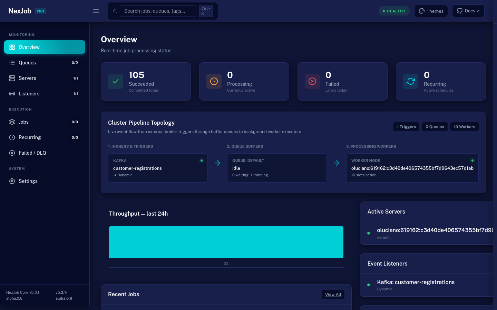

# Dashboard

Monitor, debug, and manage jobs through the enterprise Maxton-inspired UI.

[](../assets/dashboard-overview.png)

---

## Features

- **Maxton Design System:** Complete visual modernization with a 64px Top Header, responsive collapsible sidebar toggle (☰), live cluster health indicator (`HEALTHY`, `DEGRADED`, `INCIDENT`), and keyboard shortcut search (`Ctrl + K`).
- **5 Built-In Themes:** Instant 1-click theme customizer offcanvas drawer supporting `Blue Theme` (Midnight - default), `Dark`, `Light`, `Semi-Dark`, and `Bordered`, fully persisted in `localStorage`.
- **Cluster Pipeline Topology Map:** Native animated SVG & CSS flowchart connecting Ingress & Triggers ➔ Queue Buffers ➔ Processing Workers with live activity pulses.
- **Real-Time Live Log Streaming (SSE):** Streaming log viewer on `/jobs/{id}` displaying logs line-by-line via Server-Sent Events as the job executes.
- **Active Event Triggers & Listeners:** Dedicated `/listeners` page monitoring connected message brokers (RabbitMQ, Kafka, SQS, Azure Service Bus, etc.), consumer groups, target queues, and status (`Listening`, `Reconnecting`, `Faulted`).
- **Interactive Controls & Time Filters:** Pause and Resume queues with 1 click; filter jobs by time periods (`1h`, `6h`, `24h`, `7d`).
- **Zero External Dependencies:** 100% self-contained in native CSS and vanilla JS — no external NPM, Webpack, or CDN downloads required.

---

## Packages

The dashboard UI is self-contained and pre-packaged, but kept in dedicated NuGet packages to avoid dragging web dependencies into headless workers:

| Application Type | NuGet Package | Setup Method |
|---|---|---|
| **ASP.NET Core Web App** | `NexJob.Dashboard` | `app.UseNexJobDashboard()` |
| **Worker Service / Console** | `NexJob.Dashboard.Standalone` | `services.AddNexJobStandaloneDashboard()` |

---

## ASP.NET Core

### 1. Install Package

```bash
dotnet add package NexJob.Dashboard
```

### 2. Configure `Program.cs`

> [!IMPORTANT]
> `builder.Services.AddMemoryCache()` is registered automatically by `AddNexJob()`. You can configure dashboard options via delegate or `appsettings.json`.

```csharp
using NexJob;
using NexJob.Dashboard;

var builder = WebApplication.CreateBuilder(args);

// Register NexJob (registers in-memory storage by default, or your preferred provider)
builder.Services.AddNexJob();

var app = builder.Build();

// Mount dashboard middleware (default: /dashboard)
app.UseNexJobDashboard();

// Or custom path and options:
// app.UseNexJobDashboard("/dashboard", options =>
// {
//     options.Title = "Enterprise NexJob Console";
//     options.MetricsCacheTtl = TimeSpan.FromSeconds(3);
// });

app.Run();
```

---

## Standalone (Worker Services)

For Worker Services or console applications that do not have their own ASP.NET Core HTTP pipeline, use the standalone dashboard. It runs an embedded HTTP server hosting the UI.

### 1. Install Package

```bash
dotnet add package NexJob.Dashboard.Standalone
```

### 2. Configure `Program.cs`

```csharp
using NexJob;
using NexJob.Dashboard.Standalone;

var builder = Host.CreateApplicationBuilder(args);

// Register NexJob
builder.Services.AddNexJob();

// Registers embedded HTTP server (default: http://localhost:5005/dashboard)
builder.Services.AddNexJobStandaloneDashboard();

// Or customize host and port:
// builder.Services.AddNexJobStandaloneDashboard(options =>
// {
//     options.Port = 5005;
//     options.Path = "/dashboard";
//     options.Title = "Worker Dashboard";
//     options.LocalhostOnly = true;
// });

var host = builder.Build();
host.Run();
```

---

## Authorization

By default, the dashboard is open. Add authorization by implementing `IDashboardAuthorizationHandler`.

```csharp
public sealed class AdminDashboardAuth : IDashboardAuthorizationHandler
{
    public Task<bool> AuthorizeAsync(HttpContext context)
    {
        // Example: check for admin role
        return Task.FromResult(context.User.IsInRole("Admin"));
    }
}

builder.Services.AddTransient<IDashboardAuthorizationHandler, AdminDashboardAuth>();
```

Multiple handlers are allowed — any handler returning `true` grants access.

---

## Debugging Failed Jobs

1. Open the dashboard and navigate to **Failed** tab
2. Click on a failed job to see:
   - Error message and full stack trace
   - Number of attempts and retry timeline
   - Job input (deserialized)
   - Queue, tags, and creation/completion timestamps
3. Use this information to diagnose and fix the issue

---

## Reading the Execution Timeline

Each job displays its lifecycle:

```
Created:  2026-04-08 10:00:00 UTC
Enqueued: 2026-04-08 10:00:01 UTC
Started:  2026-04-08 10:00:03 UTC  (2s queue wait)
Failed:   2026-04-08 10:00:05 UTC  (2s execution)
Retried:  2026-04-08 10:00:35 UTC  (30s backoff)
Started:  2026-04-08 10:00:36 UTC
Succeeded:2026-04-08 10:00:38 UTC
```

Key timestamps to check:

- **Queue wait time** = `Started - Enqueued` — high values indicate insufficient workers
- **Execution time** = `Completed - Started` — high values indicate slow job or external dependency
- **Retry gaps** — show backoff delays between attempts

---

## Requeuing Safely

The dashboard allows requeuing failed or expired jobs:

1. Select the job in the **Failed** or **Expired** tab
2. Click **Requeue**
3. A new `JobRecord` is created with the same input, preserving the original for audit

**Important:** Requeue creates a new job — it does not modify the existing one. The original job remains in its terminal state for historical tracking.

---

## Monitoring Queues

The dashboard shows:

- Queue depth (jobs waiting per queue)
- Processing jobs (currently executing)
- Paused queues (managed via runtime settings)
- Worker count and active servers

---

## Multi-Service Architecture & Dashboard Queue Isolation

When running multiple independent microservices against a shared database or cluster, each service typically owns a dedicated set of queues (e.g. `billing`, `inventory`, `notifications`).

### Dedicated Ops Host Mode

To avoid background processing on the ops dashboard host, configure `DisableWorkers = true`:

```csharp
builder.Services.AddNexJobStandaloneDashboard(options =>
{
    options.Port = 5005;
    options.Path = "/dashboard";
    options.Title = "Global Ops Dashboard";
    options.DisableWorkers = true; // Sets Workers = 0 on this host
});
```

### Queue Scoping (Isolation)

You can scope any dashboard instance to a subset of queues via `options.Queues`. The dashboard will filter navigation counters, queue cards, and default job queries exclusively to those queues:

```csharp
// In ASP.NET Core:
app.UseNexJobDashboard("/dashboard", options =>
{
    options.Title = "Billing Service Dashboard";
    options.Queues = ["billing", "invoices"];
});

// In Standalone Dashboard:
builder.Services.AddNexJobStandaloneDashboard(options =>
{
    options.Title = "Inventory Ops";
    options.Queues = ["inventory", "warehouse"];
    options.DisableWorkers = true;
});
```

When scoped to a single queue, the `/jobs` page automatically defaults its filter to that queue.
 
---
 
## Multi-Cluster Dashboard Federation
 
Federate and aggregate multiple independent NexJob clusters (e.g. production, staging, regional clusters, or multi-tenant databases) within a single dashboard UI without installing extra packages.
 
### Registering Clusters
 
Register named `DashboardCluster` instances via `DashboardOptions.AddCluster` or `StandaloneDashboardOptions.AddCluster`:
 
```csharp
// ASP.NET Core Web App
app.UseNexJobDashboard("/dashboard", options =>
{
    options.Title = "Global Management Console";
    options.AddCluster(new DashboardCluster(
        id: "prod-us",
        name: "Production (US-East)",
        dashboardStorage: prodStorage,
        isReadOnly: true)); // Disables mutating POST actions
 
    options.AddCluster(new DashboardCluster(
        id: "prod-eu",
        name: "Production (EU-West)",
        dashboardStorage: euStorage,
        isReadOnly: true));
 
    options.AddCluster(new DashboardCluster(
        id: "staging",
        name: "Staging Cluster",
        dashboardStorage: stagingStorage,
        isReadOnly: false));
});
 
// Or in Standalone Dashboard:
builder.Services.AddNexJobStandaloneDashboard(options =>
{
    options.Port = 5005;
    options.Title = "Ops Federation Hub";
    options.DisableWorkers = true; // Dedicated ops host mode
    options.AddCluster(new DashboardCluster("cluster-a", "Billing Cluster", billingStorage));
    options.AddCluster(new DashboardCluster("cluster-b", "Logistics Cluster", logisticsStorage));
});
```
 
### Multi-Cluster UI & Switching
 
- When 2 or more clusters are registered, a **Cluster Switcher** dropdown automatically appears in the top header.
- Active cluster selection is persisted and controlled via the URL query parameter `?cluster={id}`.
- If no cluster parameter is supplied or an unknown ID is specified, the dashboard defaults gracefully to the first registered cluster.
- All metrics cards, servers, recurring jobs, log modals, and SSE streams (`/stream`) route exclusively to the active cluster.
- Read-only clusters (`isReadOnly: true`) reject mutating actions (Run Now, Requeue, Delete, Pause/Resume) with `403 Forbidden` and hide execution buttons.
- When no clusters are registered, the dashboard operates seamlessly in single-cluster mode querying services directly from DI.
 
---

## Job Catalog & Definitions (`/catalog`)

Inspect distinct job types, performance metrics, queue distributions, error rates, and trigger parameterless jobs on demand.

[](../assets/dashboard-catalog.png)

### Key Capabilities

- **Aggregated Telemetry:** Distinct job types and queues aggregated via `IDashboardStorage.GetJobCatalogAsync()`, reporting total executions, succeeded count, failed count, failure rate percentage, and average execution duration.
- **Deep History Linking:** Each catalog entry features a direct **History** link navigating to `/jobs?search={JobType}&queue={Queue}`, immediately filtering historical execution records for detailed diagnostics.
- **On-Demand Ad-Hoc Execution (Trigger):** For parameterless jobs implementing `IJob`, execute jobs immediately with a single click from the catalog table. (Disabled automatically on read-only clusters).
- **Cluster & Multi-Tenant Aware:** Seamlessly reflects catalog statistics for the active cluster selected in multi-cluster federation (`?cluster={id}`).

> [!WARNING]
> **Storage Provider Deprecation Notice:**
> `IDashboardStorage.GetJobCatalogAsync` currently features a default interface implementation for backward compatibility. In NexJob v6.0, this method will become abstract across all storage providers. Custom storage providers should implement native aggregated queries (`GROUP BY job_type, queue`) to prepare for v6.0.

---
 
## Next Steps

 
- [Configuration Reference](11-Configuration-Reference.md) — Dashboard options
- [Troubleshooting](16-Troubleshooting.md) — Dashboard not showing jobs
- [Best Practices](13-Best-Practices.md) — Production dashboard guidelines
